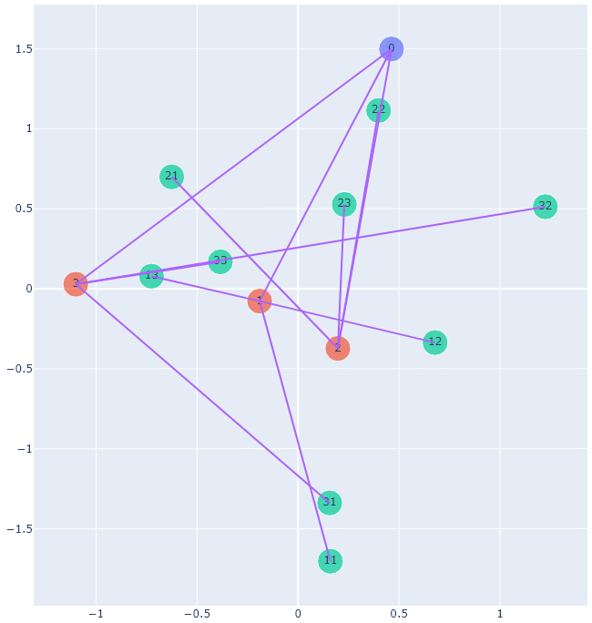
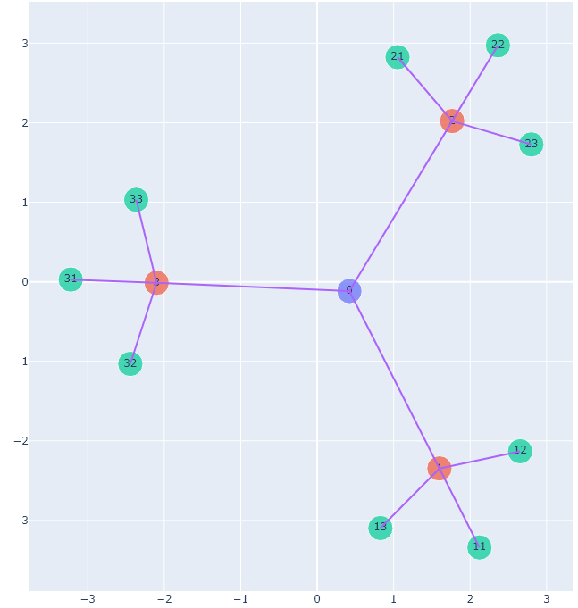

## KK graph layout tensorflow
Optimize graph layout using tensorflow

* Before training (all node coordinates are random initialize):

* After training:

# Credit
I adopted most of the code for building tensorflow model and tree from https://github.com/misonuma/tsntm

